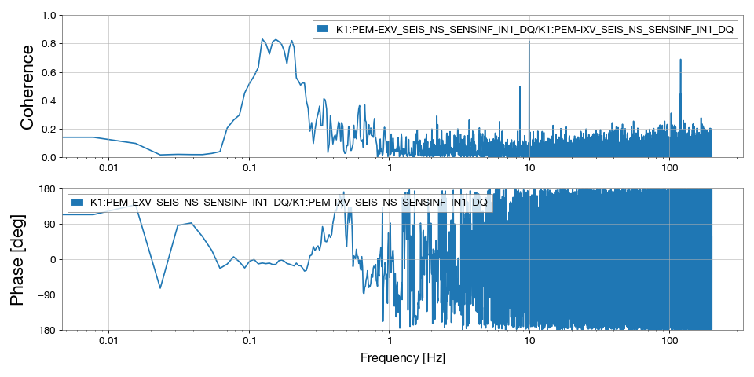

Dttpy
====

Dttpy can convert data embedded in the xml diaggui file to numpy.array.

## Install
Clone or download own workspace.

## How to use
1. Prepare the diaggui file which is 

## How to use
Download dttdata.py on your work space. In this case, file name is 'test.xml'.

Call DttData module and you can use some methods 

```
from dttdata import DttData
d = DttData('test.xml')

chnameA = 'K1:PEM-IY0_SEIS_NS_SENSINF_OUT_DQ'
chnameB = 'K1:PEM-EX1_SEIS_NS_SENSINF_OUT_DQ'
f,asd = d.getASD(chnameA,ref=False)
f,mag,deg = d.getCoherence(chnameA,chnameB,ref=False)
...
```

Also you can plot.

```
...
import matplotlib.pyplot as plt
fig, (ax0,ax1) = plt.subplots(2,1,figsize=(12, 6), dpi=80)
ax0.semilogx(f,mag,label='/'.join([chnameB,chnameA]))
ax0.legend()
ax0.set_ylim(0,1)
ax0.set_ylabel('Coherence',fontsize=20)
ax1.semilogx(f,deg,label='/'.join([chnameB,chnameA]))
ax1.legend()
ax1.set_ylim(-180,180)
ax1.set_yticks(range(-180,181,90))
ax1.set_ylabel('Phase [deg]',fontsize=20)
ax1.set_xlabel('Frequency [Hz]',fontsioze=20)
plt.savefig('test_coh.png')
plt.close()
```



## Contribution
Koki.Okutomi

## Licence

[MIT](https://github.com/MiyoKouseki/dttpy/tree/master/LICENCE)

## Author

[MiyoKouseki](https://github.com/MiyoKouseki)